# MCServerDownloadTool 设计

## 范围

MCServerDownloadTool 将严格的 `server-install.json` 转换成可启动的 Minecraft 服务端目录。当前可执行程序已经连接完整安装链：配置解析、manifest 校验、Java 发现与选择、共享下载、手动文件门禁、官方 Loader 安装、启动产物验证、脚本生成和持久状态写入。

不在范围内：自动下载 Java、服务端进程守护、世界备份、在线升级、自动接受 EULA，以及在启动脚本中执行下载或校验。

## 执行链

```mermaid
flowchart LR
    CLI["CLI / locale / proxy"] --> Manifest["读取并严格校验 server-install.json"]
    Manifest --> Java["发现、探测并选择同主版本 Java"]
    Java --> Lock["获取 .mcsdt 安装锁"]
    Lock --> Inspect["校验已有文件、状态和 Loader 输出"]
    Inspect --> Download["共享引擎并发下载自动文件与 Loader installer"]
    Download --> Manual["统一检查手动文件"]
    Manual --> Loader["运行或复用官方 Loader 安装结果"]
    Loader --> Output["严格验证最终启动产物"]
    Output --> Commit["原子写入启动脚本和 install-state.json"]
```



默认 manifest 是当前可执行文件同目录的 `server-install.json`。显式 `--manifest` 可以选择其他文件；安装根目录始终取所选 manifest 的父目录，不受当前工作目录影响。

语言优先级为 CLI、系统 locale、英文。代理优先级为 CLI、`HTTPS_PROXY`、`ALL_PROXY`、`HTTP_PROXY`，之后是对应小写变量。显式配置的第一个无效代理直接失败，不跳过并尝试更低优先级来源。

## Manifest v1

顶层字段为 `schema_version`、`minecraft`、`java`、`loader`、可选 `curseforge_api_key` 和 `files`。所有对象使用 `deny_unknown_fields`，语义校验 fail-fast。

### Minecraft 与 Java

- `minecraft.version` 必须非空。
- `java.major` 为 `1..=255`。
- `min_memory_mb` 大于零且不超过 `max_memory_mb`。
- `jvm_args` 和 `server_args` 是独立参数数组；空白项、NUL 和换行被拒绝。

Manifest 不保存本机 Java 路径。Java 层从平台约定路径生成候选，规范化去重后并行执行 `java -XshowSettings:properties -version`，只保留主版本完全匹配的运行时。Java 8 的 `1.8` 映射为主版本 8。候选存在时用户按序号选择；没有候选时反复要求输入 Java executable 或 Java Home，并对输入执行同样验证。工具不提供 managed JDK 下载兜底。

发现来源覆盖 PATH、`JAVA_HOME`/`JRE_HOME`、Windows 常见厂商注册表与 Program Files、Linux JVM 目录、macOS JavaVirtualMachines/`java_home`、SDKMAN、asdf、Gradle/IDE toolchains 和 Minecraft runtime。可选来源读取失败形成可见 warning；无法初始化发现或并发探测则终止。

### Loader

支持 `forge`、`fabric`、`neoforge`、`cleanroom`，均要求非空精确版本。Installer URL 必须是无凭据、无 fragment 的绝对 HTTPS JAR；完整性来源必须在 inline SHA-1 与同源 SHA-1 sidecar 中二选一，可附加精确 size。

执行契约：

- Forge、NeoForge、Cleanroom：`java -jar installer --installServer`。
- Fabric：`java -jar installer server -mcversion <MC> -loader <VERSION> -downloadMinecraft`。
- HTTP/HTTPS proxy 作为拆分后的 JVM system properties 传入；SOCKS proxy 在需要执行上游 installer 时明确拒绝。
- stdout/stderr 按行实时转发，不缓存到进程结束后才显示。

Loader 返回成功后仍必须验证 manifest 声明的精确输出。Forge/NeoForge 可以使用 `modern_args` 的 Windows/Unix 参数文件；`exact_jar` 检查非空精确路径，Fabric 还检查 JAR manifest 的 `Main-Class`。禁止模糊扫描 JAR 名称。

### Files

文件记录由 `name`、`type`、`path`、`download`、`project_page`、`sha1`、`size` 组成。`type` 仅接受 `mod`、`resource_pack`、`shader_pack`；`download` 是带 `mode` discriminator 的 `automatic { url }` 或 `manual`。

路径只接受 `/` 分隔的规范相对路径，并拒绝：

1. 绝对路径、盘符、反斜杠、NUL、空组件、`.` 和 `..`；
2. 末尾空格/点和 Windows 设备名；
3. ASCII 大小写折叠后的重复目标；
4. `server-install.json`、工具二进制、启动脚本、`missing-files.txt` 和 `.mcsdt` 命名空间。

自动 URL 与 `project_page` 都必须是无凭据、无 fragment 的绝对 HTTPS URL。每个文件必须提供精确非零 size 和 40 位十六进制 SHA-1。

自动文件与 Loader installer 进入同一批下载。随后一次性检查全部 manual 文件；失败项写入原子更新的 `missing-files.txt` 后终止，不会运行 Loader。全部补齐时删除过期清单。

### CurseForge key

只有自动 URL 位于 `forgecdn.net` 或其子域时允许并要求顶层 `curseforge_api_key`。请求构建器将 `x-api-key` 标记为敏感 header，并绑定到声明 URL 的 scheme/host/effective-port origin；逐跳重定向重新计算 header，跨源不发送。Secret 的 `Debug` 输出被替换为 `[REDACTED]`，URL 和错误日志也执行脱敏。

## 下载架构

整个安装只创建一个 `NetworkEngine`，Loader SHA-1 sidecar、Loader installer 和服务端自动文件共享 HTTP client、连接池、重试与请求预算。Loader installer 自身下载依赖的行为仍归上游 Java installer。

自适应并发公式：

```text
global_requests   = clamp(cpu * 4, 8, 64)
requests_per_host = min(global, clamp(cpu * 2, 4, 32))
requests_per_file = min(per_host, clamp(cpu, 2, 16))
```

`available_parallelism()` 失败时终止，不能使用隐藏固定值。硬上限、有限 worker queue 和有限 observer channel 防止资源或日志无限增长。

网络层使用 blocking reqwest、HTTP/2 adaptive window、连接池、显式 redirect、指数退避及 `Retry-After`。达到阈值的大文件先探测 Range；仅在范围、总大小和 validator/hash 契约足够可靠时分段。服务端忽略 Range 时回到完整下载。响应必须完成 size 与 SHA-1/SHA-256 契约后才能原子发布；失败不覆盖正确目标。

## 幂等状态与文件系统

`.mcsdt/install-state.json` 原子记录：

- 原始 manifest 字节的 SHA-256；
- 选定 Java executable；
- 完整 Loader 计划摘要；
- 验证后的 Loader 启动描述；
- 安装器生成脚本的 SHA-256。

每次运行获取独占 `.mcsdt/install.lock`。已存在文件只有 size 与 SHA-1 都匹配才复用。Loader 仅在计划摘要、Java identity、持久状态和实际输出同时匹配时复用；否则重新执行 installer。

启动脚本发布采用所有权检测：不存在则创建；内容与本次生成一致则复用；内容仍匹配上次生成摘要时可更新；用户修改过时保留原文件，将候选写到 `.new` 并返回明确冲突。状态、手动清单和文件发布使用原子写入或同文件系统临时路径。

## 启动脚本

Windows 生成 `start.bat`，Unix 生成可执行 `start.sh`。两者只包含：

- 用户选定 Java 的绝对路径；
- `-Xms`/`-Xmx`；
- manifest JVM 参数；
- 验证后的 args file 或精确 `-jar` 目标；
- manifest 服务端参数。

脚本不下载、不校验、不调用安装器、不写 EULA。Windows 对参数进行 batch quoting 和 `%` 转义，只在独占控制台中的启动失败路径执行 `pause`；Unix 使用单引号安全转义和 `exec`。

## 错误与日志

配置、manifest I/O、JSON shape、manifest 语义、Java、网络、完整性和安装错误映射到稳定退出类别。用户可修复错误写 stderr，阶段、下载进度、复用和 Loader 输出写 stdout。失败不得被吞掉；worker panic、锁中毒、队列关闭和清理异常都必须可观察。

## CI 与发布

`.github/workflows/ci.yml` 在每次 push 和 pull request 上执行 fmt、发布脚本自测、Rust test、clippy，并构建 Windows x64、Linux x64 musl、macOS Apple Silicon release binary。每个平台执行 `--version` smoke test；三平台 binary 与构建 metadata 作为保留 7 天的 Actions artifacts 上传。

`.github/workflows/release.yml` 只由 `v*` tag 触发。tag 去掉小写 `v` 后必须是严格 SemVer 2.0.0，并与 Cargo package version 完全一致。发布契约是构建并 smoke test 三个固定名称的原始二进制和各自 `.sha256`，复算 size/SHA-256，生成 `release-index.json`，为 `MCServerDownloadTool-*` 资产生成 GitHub build provenance，并在 Action 内创建非 draft Release。

所有 `uses:` 引用固定 commit SHA。Dependabot 每周检查 Cargo 和 GitHub Actions；Actions 更新仍需保持 SHA pin。
